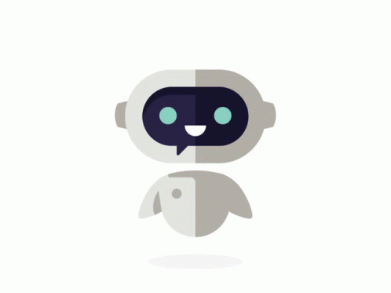

#  Resume-Chatbot-WebApp
A web app that uses my Resume Chatbot neural network model to answer questions related to my resume. You can check out a limited functionality demo version of this project <a href="https://iliabot.herokuapp.com ">here</a>!

To see the development and training process of the neural network model used in this web app, or to use the CLI version of IliaBot go to https://github.com/Iliaromanov/Resume-Chatbot-Model

You can also checkout the code for the NLP pipeline API I made as a microservice for this project at https://github.com/Iliaromanov/nlp-pipeline-API 

       

<!--To embed just the chat window (exclude background) use: <iframe src="https://www.xkcd.com/#chatbot_window"></iframe>-->
